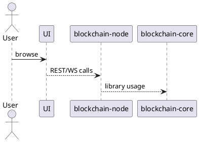

This repository contains a proof-of-concept blockchain with three main modules.

Directories and notable files
-----------------------------
- `blockchain-core/` – Java library with data models and consensus logic.
  - `build.gradle` configures library dependencies.
  - `src/main/java` holds packages `consensus`, `crypto`, `model`, `mempool`,
    `serialization` and `exceptions`.
- `blockchain-node/` – Spring Boot application built on the core library.
  - `build.gradle` defines the Spring Boot plugin and dependencies.
  - `src/main/java/de/flashyotter/blockchain_node` contains configuration,
    REST controllers, services and P2P networking.
- `ui/` – React + TypeScript front-end for interacting with the node.
  - `package.json` and `vite.config.ts` drive the Node build.
  - `src` holds React components and API helpers.
- `gradle/` – Gradle wrapper and version catalog `libs.versions.toml`.
- `data/` – runtime LevelDB store for blocks and wallet.
- `pipeline-tests/` – Behave features validating multi-node sync and regression.
- `scripts/` – local CI (`ci-local.sh`) and Docker health check scripts.
- `.github/` – GitHub Actions workflow; see its `AGENTS.md`.
- `.vscode/` – launch configuration for developing in VS Code.
- `settings.gradle` – lists included modules.
- `README.md` – build and usage instructions.
- gRPC API available on `NODE_GRPC_PORT` (default 9090).
- Gradle tasks `composeUp` / `composeDown` manage the Docker Compose setup.

Overall relationship
--------------------

Each module creates a `build/` directory with compiled classes and test reports after running Gradle. These outputs are not tracked in version control.
Run `./scripts/ci-local.sh` to perform a full local build and execute the Behave scenarios under `pipeline-tests/`.

Documentation tags
-------------------
- `[CI_MISMATCH]` - README mentions GitHub Actions but `.github/AGENTS.md` states none.
- `[CI_REDUNDANT]` - Local CI described via `./scripts/ci-local.sh` here but `README.md` references `./gradlew ciLocal`.
- `[DOC_BAD_TASK]` - README instructs running `./gradlew verify` which is not a defined Gradle task.

Error categories
----------------
| Category | Tags | Description |
|---------|------|-------------|
| CI | `CI_MISMATCH`, `CI_REDUNDANT` | Inconsistent or duplicate CI documentation |
| DOC | `DOC_BAD_TASK` | Invalid or outdated instructions |

Principles
----------
Record mismatching, redundant or logically incorrect guidance with one of the tags above in the `AGENTS.md` located next to the offending file. Reuse existing categories where possible so the registry stays manageable.
