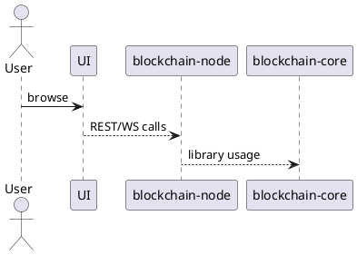

This repository contains a proof-of-concept blockchain made up of several
modules and helper scripts.

Directories and notable files
-----------------------------
- `blockchain-core/` – Java library with data models and consensus logic.
  - `build.gradle` configures library dependencies.
  - `src/main/java` holds packages `consensus`, `crypto`, `model`, `mempool`,
    `serialization` and `exceptions`.
- `blockchain-node/` – Spring Boot application built on the core library.
  - `build.gradle` defines the Spring Boot plugin and dependencies.
  - `src/main/java/de/flashyotter/blockchain_node` contains configuration,
    REST controllers, services and P2P networking.
- `ui/` – React + TypeScript front-end for interacting with the node.
  - `package.json` and `vite.config.ts` drive the Node build.
  - `src` holds React components and API helpers.
- `Dockerfile.backend` / `Dockerfile.frontend` – container images for the node
  and web UI.
- `docker-compose.yml` – orchestrates backend and frontend containers.
- `.env` – ports and secrets consumed by Docker and the app.
- `gradle/` – Gradle wrapper and version catalog `libs.versions.toml`.
- `data/` – runtime LevelDB store for blocks and wallet.
- `startup.py` – convenience script to launch backend and UI locally.
- `copyjava.py`, `copyts.py`, `copier.sh` – helper scripts to export source files.
- `.github/` – CI workflow definition.
- `settings.gradle` – lists included modules.
- `README.md` – build and usage instructions.
- `README.md.agent.md` – brief description for Codex.

Networking uses WebSocket connections between nodes. Each peer sends a
`HANDSHAKE` containing its node ID and protocol version. After syncing blocks via
`GET_BLOCKS`/`BLOCKS`, the `Chain` component automatically re-orgs to the branch
with the most cumulative work so that nodes converge on their last shared block.

Overall relationship
--------------------

Each module creates a `build/` directory with compiled classes and test reports after running Gradle. These outputs are not tracked in version control.
