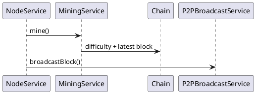

`blockchain-node` contains the Spring Boot application built on `blockchain-core`.

Important paths under `src/main/java/de/flashyotter/blockchain_node`:
- `BlockchainNodeApplication.java` – entry point starting the HTTP server and libp2p host.
- `bootstrap/StartupInitializer.java` – tasks executed at startup.
- `config/` – Spring configuration classes (`SecurityConfig`, `P2PConfig`, ...).
- `controller/` – REST controllers for chain, mining, transactions and wallet.
  `NodeController` exposes `/node/enr` and `SnapshotController` serves snapshot
  files for syncing.
- `service/` – business logic (`NodeService`, `MiningService`, etc.).
- `p2p/` – `Peer`, `PeerClient` and `PeerServer` for libp2p networking.
- `storage/` – `BlockStore` with LevelDB and in-memory implementations.
- `wallet/` – wallet and keystore utilities.
- `grpc/` – service implementations from `src/main/proto`.

gRPC and P2P message schemas are defined in `src/main/proto`. The module
produces a runnable Spring Boot JAR via `build.gradle` which also configures
protobuf code generation.

Tests under `src/test` exercise REST controllers, services and networking
components.

