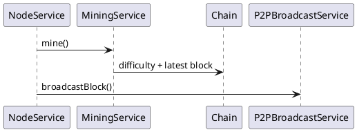

`blockchain-node` contains the Spring Boot application built on `blockchain-core`.

The Gradle build produces a runnable JAR. A `Dockerfile` in this folder packages the image for Compose. Temporary LevelDB data may appear in `no-such-dir/`.

Important paths under `src/main/java/de/flashyotter/blockchain_node`:
- `BlockchainNodeApplication.java` – entry point starting the HTTP & WebSocket server.
- `bootstrap/StartupInitializer.java` – tasks executed at startup.
- `config/` – Spring configuration classes (`SecurityConfig`, `WebSocketConfig`, ...).
- `controler/` – REST controllers for chain, mining, transactions and wallet.
- `service/` – business logic (`NodeService`, `MiningService`, etc.).
- `p2p/` – `Peer`, `PeerClient` and `PeerServer` for WebSocket networking.
- `discovery/` – minimal Kademlia peer discovery (`PeerDiscoveryService`).
- `storage/` – `BlockStore` with LevelDB and in-memory implementations.
- `wallet/` – wallet and keystore utilities.

Resources in `src/main/resources` define application defaults. Tests in
`src/test` cover controllers, services and networking.

`PeerServer` and `PeerClient` exchange a `HANDSHAKE` message when a WebSocket
connection is established. `SyncService` then requests missing blocks starting
from the local height. The `Chain` library re-organises automatically if the
remote branch represents more work, merging the two node states at their last
common block.

