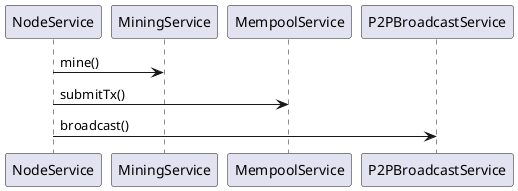

This package contains the services composing the node.

- `NodeService` – orchestrates chain state, mining and broadcasting.
- `MiningService` – builds candidate blocks from the mempool and performs PoW.
- `MempoolService` – holds unconfirmed transactions.
- `P2PBroadcastService` (via `P2PBroadcastPort`) – sends blocks and txs to peers.
- `PeerService` with `PeerRegistry` – manages the list of known peers.
- `DiscoveryLoop` and `SyncService` – keep peers connected and the chain synced.
- gRPC service classes expose these operations remotely.

