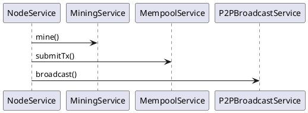

This package contains the services composing the node.

- `NodeService` – orchestrates chain state, mining and broadcasting.
- `MiningService` – builds candidate blocks from the mempool and performs PoW.
- `MempoolService` – holds unconfirmed transactions.
- `P2PBroadcastService` (via `P2PBroadcastPort`) – sends blocks and txs to peers.
- `PeerService` with `PeerRegistry` – manages the list of known peers.
- `DiscoveryLoop` and `SyncService` – keep peers connected and the chain synced.
- gRPC service classes expose these operations remotely.

Errors
------
- `[LOGIC_RESOURCE_LEAK]` - `SnapshotService.compactSnapshots` does not close
  the directory stream returned by `Files.list`, leaking file handles.
- `[LOGIC_BAD_ORDER]` - `NodeService.blockPage` returns pages in ascending order
  despite claiming a descending view.
- `[LOGIC_MINING_LOOP]` - `MiningService.mine` increments the nonce several
  times before re-checking the proof, skipping candidate hashes.
- `[LOGIC_BAD_CHECK]` - `PeerRegistry.addAll` adds peers without marking them
  pending for dialing.
